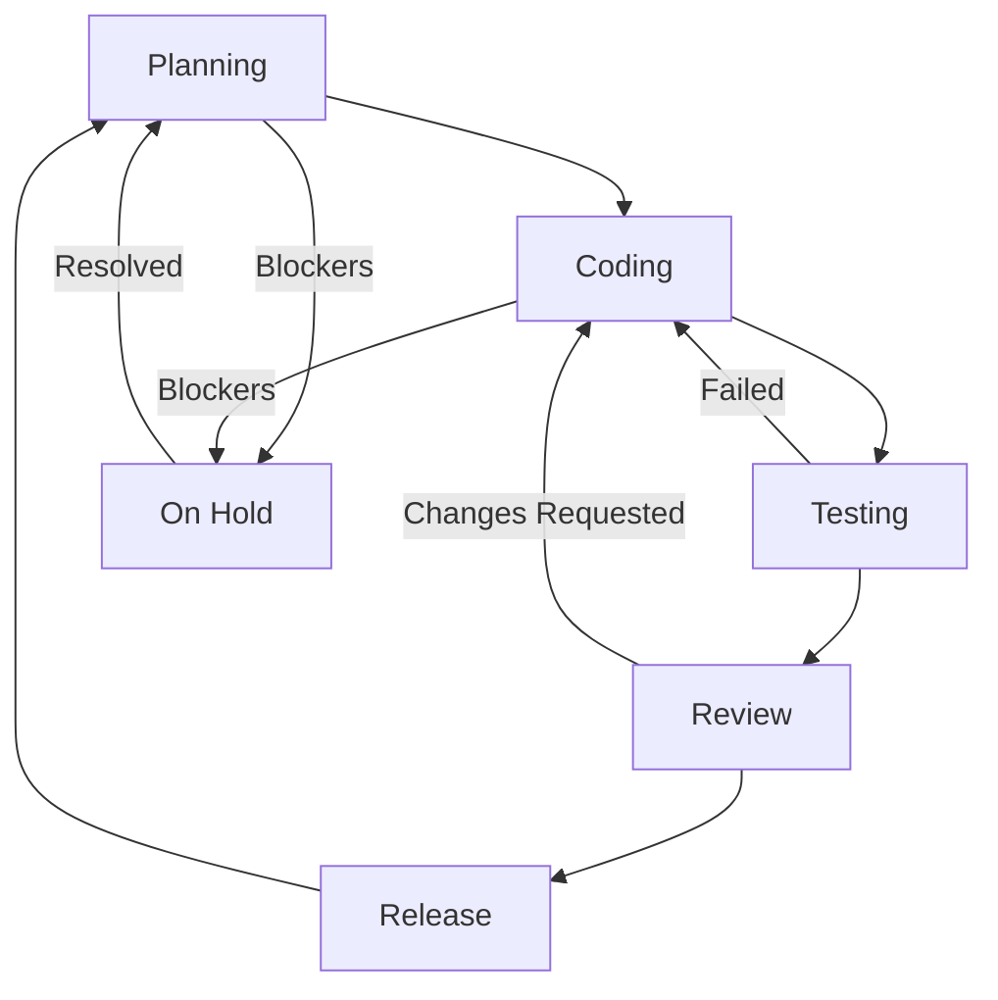

# BMAD Handover Protocol

**Version:** 1.0.0  
**Last Updated:** 2025-11-21T03:36:57-04:00  
**Framework:** BMAD-GitHub Native Full Cycle

---

## Current State

### Active Persona

**[DEV]**

### Current Phase

**Phase 5: Validation Final ("Test Flight")** 🔄 IN PROGRESS

### Project Status

🔄 **VALIDATING** - Implementing Health Check API

---

## Handover History

### [STEP-001] 2025-11-21T04:19:30-04:00

- **From:** User Request
- **To:** [ORCHESTRATOR]
- **Action:** Initialize BMAD-GitHub Native Full Cycle - Phase 1 Complete
- **Artifacts Created:**
  - `task.md` - Implementation plan
  - `.clinerules` - Agent rules and persona definitions (245 lines)
  - `.github/BMAD_HANDOVER.md` - This file (state tracker)
  - `.clineignore` - Token optimization (56 lines)
  - `productContext.md` - Memory Bank long-term knowledge
  - `activeContext.md` - Memory Bank session context
  - `README.md` - Repository documentation
- **Repository:** Created <https://github.com/helton-godoy/bmad-github-native-full-cycle>
- **Commit:** `[ORCHESTRATOR] [STEP-001] Initialize BMAD-GitHub Native Full Cycle foundation`
- **Next Steps:** Phase 2 - Infrastructure (GitHub Actions, Issue Templates, Security)
- **Blockers:** None

### [STEP-005] 2025-11-21T04:34:00-04:00

- **From:** [ORCHESTRATOR]
- **To:** [DEVOPS], [SCRUM], [SECURITY]
- **Action:** Complete Phase 2 - Infrastructure Setup
- **Artifacts Created:**
  - `.github/workflows/ci.yml` - CI/CD pipeline
  - `.github/workflows/linter.yml` - Code quality checks
  - `.github/workflows/security.yml` - Security scanning (CodeQL, npm audit)
  - `.github/ISSUE_TEMPLATE/user_story.md` - User Story template
  - `.github/ISSUE_TEMPLATE/epic.md` - Epic template
  - `.github/ISSUE_TEMPLATE/bug.md` - Bug Report template
  - `SECURITY.md` - Security policy and vulnerability reporting
- **Commits:**
  - `[DEVOPS] [STEP-003] Create GitHub Actions workflows (CI, Linter, Security)`
  - `[SCRUM] [STEP-004] Create Issue templates (User Story, Epic, Bug)`
  - `[SECURITY] [STEP-005] Create SECURITY.md policy`
- **MCP Status:** Attempted `mcp0_push_files` - Failed with "401 Bad credentials"
- **Fallback:** Git CLI used successfully for push
- **Next Steps:** Phase 3 - Validation (complete cycle test)
- **Blockers:** MCP GitHub token may need refresh/permissions update

---

## Artifacts Registry

| Artifact | Created By | Date | Location | Status |
|----------|-----------|------|----------|--------|
| Implementation Plan | [ORCHESTRATOR] | 2025-11-21 | `task.md` | ✅ Complete |
| Agent Rules | [ORCHESTRATOR] | 2025-11-21 | `.clinerules` | ✅ Complete |
| Handover Protocol | [ORCHESTRATOR] | 2025-11-21 | `.github/BMAD_HANDOVER.md` | ✅ Complete |
| Token Optimizer | [ORCHESTRATOR] | 2025-11-21 | `.clineignore` | ✅ Complete |
| Memory Bank (Long-term) | [ORCHESTRATOR] | 2025-11-21 | `productContext.md` | ✅ Complete |
| Memory Bank (Session) | [ORCHESTRATOR] | 2025-11-21 | `activeContext.md` | ✅ Complete |
| Repository README | [ORCHESTRATOR] | 2025-11-21 | `README.md` | ✅ Complete |
| CI Workflow | [DEVOPS] | 2025-11-21 | `.github/workflows/ci.yml` | ✅ Complete |
| Linter Workflow | [DEVOPS] | 2025-11-21 | `.github/workflows/linter.yml` | ✅ Complete |
| Security Workflow | [SECURITY] | 2025-11-21 | `.github/workflows/security.yml` | ✅ Complete |
| User Story Template | [SCRUM] | 2025-11-21 | `.github/ISSUE_TEMPLATE/user_story.md` | ✅ Complete |
| Epic Template | [SCRUM] | 2025-11-21 | `.github/ISSUE_TEMPLATE/epic.md` | ✅ Complete |
| Bug Template | [SCRUM] | 2025-11-21 | `.github/ISSUE_TEMPLATE/bug.md` | ✅ Complete |
| Security Policy | [SECURITY] | 2025-11-21 | `SECURITY.md` | ✅ Complete |
| PRD (Auth) | [PM] | 2025-11-21 | `docs/planning/PRD-user-authentication.md` | ✅ Complete |
| Tech Spec (Auth) | [ARCHITECT] | 2025-11-21 | `docs/architecture/SPEC-user-authentication.md` | ✅ Complete |
| QA Report | [QA] | 2025-11-21 | `docs/testing/QA-REPORT-v0.1.0.md` | ✅ Complete |
| Release v0.1.0 | [RELEASE] | 2025-11-21 | GitHub Release / Tag | ✅ Complete |

---

## State Flow



---

## Persona Transitions

### Valid States

- **Planning:** [PM] → [ARCHITECT] → [SCRUM]
- **Coding:** [DEV]
- **Testing:** [QA]
- **Review:** [QA] (PR Review Phase)
- **Release:** [RELEASE]
- **Infrastructure:** [DEVOPS] | [SECURITY] (on-demand)

### Current Transition

**Status:** Project Complete

**Next Persona:** N/A - Handover to User

---

## Active Context

### Current Focus

Implementing foundational governance files for autonomous BMAD workflow.

### Token Budget Status

- **Used:** ~3000 tokens (Initial setup)
- **Remaining:** ~197000 tokens
- **Phase Budget:** ~2000 tokens (Planning/Setup)

### Priority Files

1. `.clinerules` ✅
2. `.github/BMAD_HANDOVER.md` ✅ (this file)
3. `task.md` ✅
4. `.clineignore` ⏳ (pending)
5. `productContext.md` ⏳ (pending)

---

## Blockers and Issues

### Current Blockers

None

### Resolved Issues

None

### Pending Decisions

1. Define specific files for `.clineignore` (to optimize token usage)
2. Determine if Memory Bank files (`productContext.md`, `activeContext.md`) are needed for this project

---

## Metrics

### Autonomy Score

**N/A** (Not yet started autonomous cycle)

### Commit Count by Persona

- [ORCHESTRATOR]: 2 (STEP-001 foundation, STEP-002 README)
- [PM]: 1 (STEP-006 PRD)
- [ARCHITECT]: 1 (STEP-007 Spec)
- [SCRUM]: 2 (STEP-004 Issue templates, STEP-008 Issue creation)
- [DEV]: 3 (STEP-009 Setup, STEP-010 Impl, STEP-013 Deps)
- [QA]: 1 (STEP-011 Report)
- [DEVOPS]: 1 (STEP-003 workflows)
- [SECURITY]: 1 (STEP-005 security policy)
- [RELEASE]: 1 (STEP-012/014 Merge & Tag)

### Rollback Points

- **STEP-001:** Initial configuration (safe rollback point)

---

## Notes

### Implementation Strategy

Using native Kilo Code features for context management instead of external ContextGuard scripts:

- **Context Condensing:** Automatic (native)
- **Memory Bank:** Markdown files (`productContext.md`, `activeContext.md`)
- **Token Economy:** `.clineignore` + Hybrid RAG (`codebase_search` + `grep`)

### GitHub Integration

All BMAD artifacts will be mapped to native GitHub features:

- PRD/SPEC → Wiki or `docs/` folder
- Tasks → GitHub Issues
- Implementation → Branches + PRs
- Tests → GitHub Actions
- Release → GitHub Releases + Tags

---

## Commands

### Update this file

```bash
# When transitioning personas, update:
# 1. Active Persona
# 2. Current Phase
# 3. Add entry to Handover History
# 4. Update Artifacts Registry
# 5. Update Blockers (if any)
```

### Query current state

Use `/status` command in agent to display summary.

### Force handover

Use `/handover` command to manually trigger state update.

### Rollback

Use `/rollback [STEP-ID]` to revert to a specific state.

---

**End of Handover Protocol**
